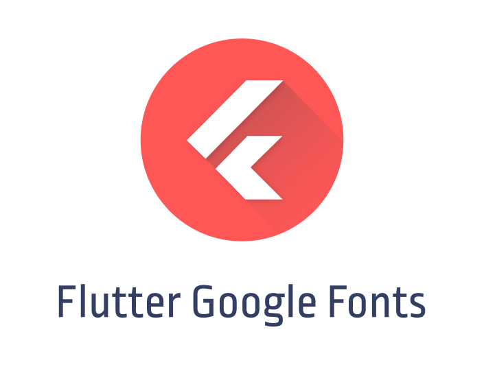

<p align="center">
  
</p>

# Flutter Google Fonts

Download and link Google Fonts in your flutter project automatically

## Install

If you use MacOS you can install using [homebrew](https://brew.sh/)

```
brew tap antoniott15/fgf
brew install fgf
```

Alterantive, you can download the binaries directly from [here](https://github.com/antoniott15/fgf/releases)

## Usage

First, you need to be in your flutter project dir, fgf search your pubspec.yaml and modify it adding the new font description.


## Google API

For google fonts API you can take your own credentiasls, create google_fonts.go file and paste this

```golang
      package main

      import (
        "encoding/json"
        "net/http"
      )

      const googleFontsAPIToken = "YOURTOKENGOESHERE"

      const googleFontsAPIEndpoint = "https://www.googleapis.com/webfonts/v1/webfonts?key=" + googleFontsAPIToken

      func fetchFonts() (*googleFontsResponse, error) {
        req, err := http.NewRequest(http.MethodGet, googleFontsAPIEndpoint, nil)
        if err != nil {
          return nil, err
        }

        res, err := http.DefaultClient.Do(req)
        if err != nil {
          return nil, err
        }

        if res.StatusCode != http.StatusOK {
          return nil, errGFBadResponse
        }

        fonts := new(googleFontsResponse)
        if err = json.NewDecoder(res.Body).Decode(fonts); err != nil {
          return nil, err
        }

        return fonts, nil
      }
```
